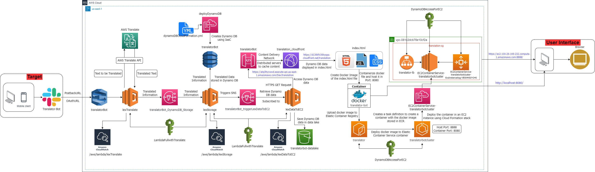

<h1>Translator-Bot</h1>
<h2>Translator chatbot built using AWS and Slack.</h2>

<h3>Repository containing codes and files related to the application - Translator Bot built using AWS cloud services</h3>
<h3>Repository Structure:</h3> 

  1. Docker Image folder contains the docker image of the html file - index.html that displays data Translation data and the html file itself.
2. Lambda folder contains the lambda functions used for the project in AWS in compressed zip folder format.
3. Lex folder contains the intents and slots used in Amazon Lex chatbot for the application in compressed zip folder format.
4. images folder contains all the images shared in the project documentation.
5. M12_Cloud_Computing_Project.drawio.png is the cloud architecture diagram of the Translator Bot application created using drawio tool.
6. TaskDefinition.json file contains the task created by CloudFormation service as part of the IaC process to create the EC2 instance and deploy the docker container in it.
7. dynamoDBCloudFormation.yml file contains the code to perform Infrastructure as Code (IaC) process.
8. index.html file contains the frontend displaying data available in DynamoDB table.

<h2> Translator Chatbot - Architecture Diagram </h2>

  

